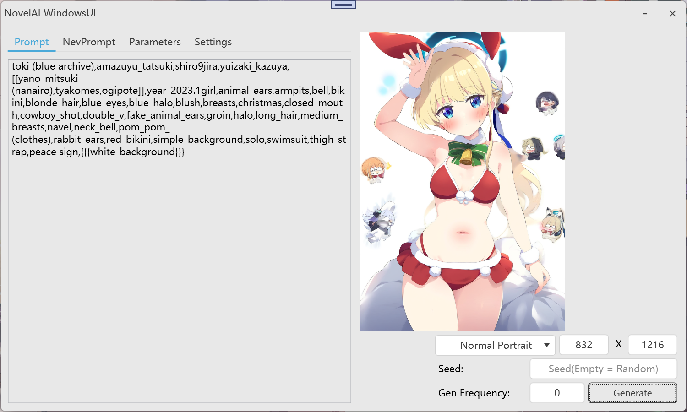
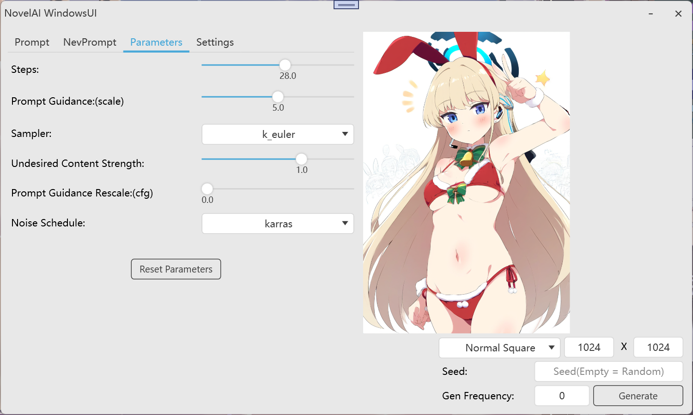
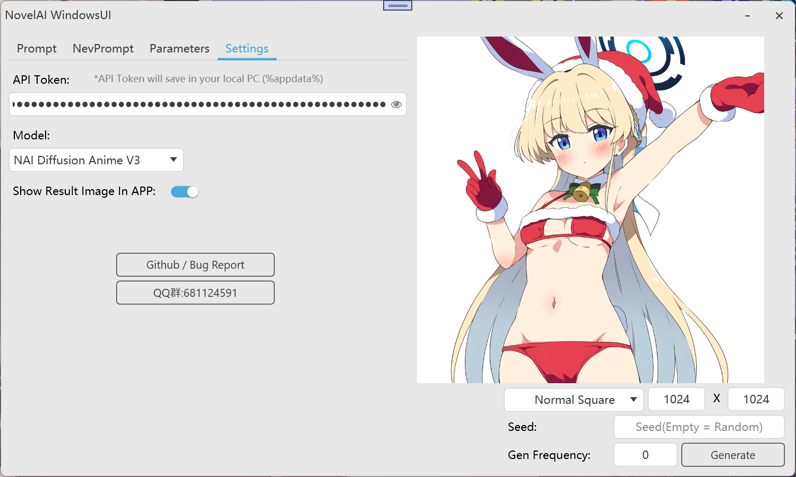
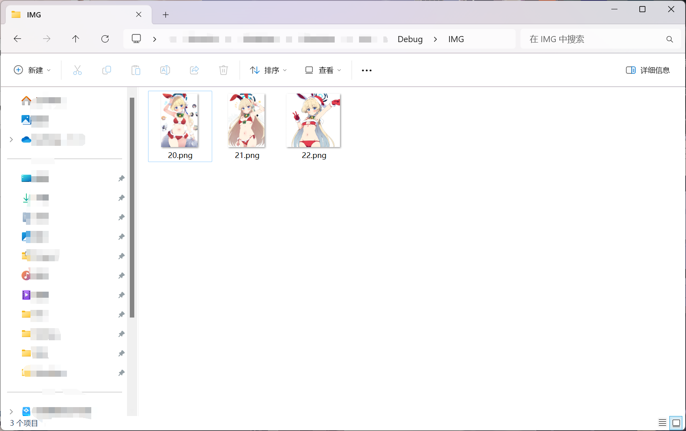
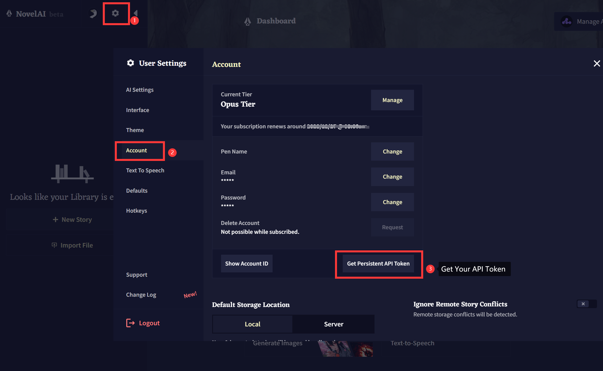

# NovelAI-WindowsUI
Native desktop application wrapped around official NovelAI APIs. / 基于原生NovelAI API封装的原生桌面应用程序。

## PREVIEW / 预览

## HOW TO USE / 使用指南
Run NovelAI WindowsUI.exe  / 直接运行 NovelAI WindowsUI.exe 即可

## Support / 支持
text to image 文生图 
批量生成图片 
自动保存图片 

## Not Support / 不支持
inpaint 重绘 
upscale 放大 
img to image 图生图 

## How to get API TOKEN / 如何获取API TOKEN

## IS SAFE? / 安全性?
The software saves all settings (including the recorded API) locally in %appdata%, and the API used is the official API. 
软件所有设置(包括记录的API)均保存在本地 (%appdata%) 中，且使用的API为官方API。

## Why write this program? / 为何编写?
Because I often forget to save images / 因为我经常忘记保存图片。

## API Docs
https://api.novelai.net/docs

## Others
Working On .NET FRAMEWORK 4.6.2 
Translate By GPT4.0 
UI By [@Mochengvia](https://github.com/Mochengvia/PanuonUI.Silver) 
Author @Kamakoto 
QQ群:681124591 
